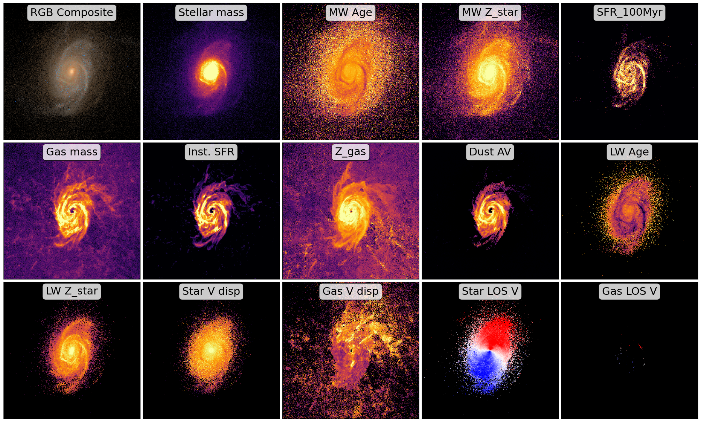

Analyzing Spatially Resolved Physical Property Maps
===================================================

After running the synthesis process, GalSyn produces a comprehensive FITS file containing synthetic imaging, IFU data cubes, and extensive set of physical property maps. 
The script below demonstrates how to visualize these spatially resolved phsyical property maps.

.. code-block:: python

    import numpy as np
    import matplotlib.pyplot as plt
    import matplotlib.cm as cm 
    from astropy.io import fits
    from astropy.visualization import simple_norm, make_lupton_rgb

    # Input synthetic data cube
    fits_filename = 'galsyn_39_107965_specphoto.fits'

    # Your specific HDU names and labels
    hdu_names = [
        'STARS_MASS', 'MW_AGE', 'STARS_MW_ZSOL', 'SFR_100MYR', 'GAS_MASS', 'SFR_INST', 
        'GAS_MW_ZSOL', 'DUST_MEAN_AV', 'LW_AGE_DUST', 'LW_ZSOL_DUST', 
        'STARS_VEL_DISP_LOS', 'GAS_VEL_DISP_LOS', 'LW_VEL_LOS_DUST', 
        'LW_VEL_LOS_NEBULAR'
    ]

    prop_labels = {
        'STARS_MASS':'Stellar mass', 'MW_AGE': 'MW Age', 'STARS_MW_ZSOL': 'MW Z_star', 
        'SFR_100MYR': 'SFR_100Myr', 'GAS_MASS': 'Gas mass', 'SFR_INST': 'Inst. SFR', 
        'GAS_MW_ZSOL': 'Z_gas', 'DUST_MEAN_AV': 'Dust AV', 'LW_AGE_DUST': 'LW Age', 
        'LW_ZSOL_DUST': 'LW Z_star', 'STARS_VEL_DISP_LOS': 'Star V disp', 
        'GAS_VEL_DISP_LOS': 'Gas V disp', 'LW_VEL_LOS_DUST': 'Star LOS V', 
        'LW_VEL_LOS_NEBULAR': 'Gas LOS V'
    }

    # RGB Filters from your example
    rgb_fils = ['jwst_nircam_f115w', 'jwst_nircam_f150w', 'jwst_nircam_f200w']
    rgb_factor = 3e+3

    # Open the data cube
    hdulist = fits.open(fits_filename)

    # Calculate grid (Total = 1 RGB + all hdu_names)
    num_plots = len(hdu_names) + 1
    ncols = 5
    nrows = (num_plots + ncols - 1) // ncols

    fig, axes = plt.subplots(nrows, ncols, figsize=(4 * ncols, 4 * nrows), constrained_layout=True)
    axes = axes.flatten()

    # Panel 1: RGB image
    ax_rgb = axes[0]
    # Use the DUST_[FILTER] naming convention from your RGB example
    r = hdulist[f'DUST_{rgb_fils[2].upper()}'].data * rgb_factor
    g = hdulist[f'DUST_{rgb_fils[1].upper()}'].data * rgb_factor
    b = hdulist[f'DUST_{rgb_fils[0].upper()}'].data * rgb_factor

    rgb_image = make_lupton_rgb(r, g, b, stretch=20, Q=15)
    ax_rgb.imshow(rgb_image, origin='lower')
    ax_rgb.text(0.5, 0.93, "RGB Composite", transform=ax_rgb.transAxes, 
                bbox=dict(boxstyle="round,pad=0.3", facecolor="white", alpha=0.8), 
                verticalalignment='center', horizontalalignment='center', fontsize=22)
    ax_rgb.set_xticks([])
    ax_rgb.set_yticks([])

    # Subsequent panels: physical property maps
    for i, ext_name in enumerate(hdu_names):
        ax = axes[i + 1] # Offset by 1 to skip the RGB panel
        
        data = hdulist[ext_name].data
        
        # Velocity Logic (Checks for 'VEL_LOS' in the HDU name)
        if 'VEL_LOS' in ext_name: 

            cmap = cm.get_cmap('bwr').copy()
            cmap.set_bad(color='black')
            
            valid_data = data[np.isfinite(data)]
            if len(valid_data) > 0:
                v_limit = np.percentile(np.abs(valid_data), 85)
                # Ensure v_limit isn't zero to avoid errors
                v_limit = max(v_limit, 1.0) 
            else:
                v_limit = 200
                
            im = ax.imshow(data, origin='lower', cmap=cmap, vmin=-v_limit, vmax=v_limit)

        else:
            cmap = cm.get_cmap('inferno').copy()
            cmap.set_bad(color='black')
            norm = simple_norm(data, 'sqrt', percent=98.0)
            im = ax.imshow(data, norm=norm, origin='lower', cmap=cmap)

        # Labels
        title_label = prop_labels.get(ext_name, ext_name)
        ax.text(0.5, 0.93, title_label, transform=ax.transAxes, 
                bbox=dict(boxstyle="round,pad=0.3", facecolor="white", alpha=0.8), 
                verticalalignment='center', horizontalalignment='center', fontsize=22)
        
        ax.set_xticks([])
        ax.set_yticks([])

    hdulist.close()

    plt.show()

