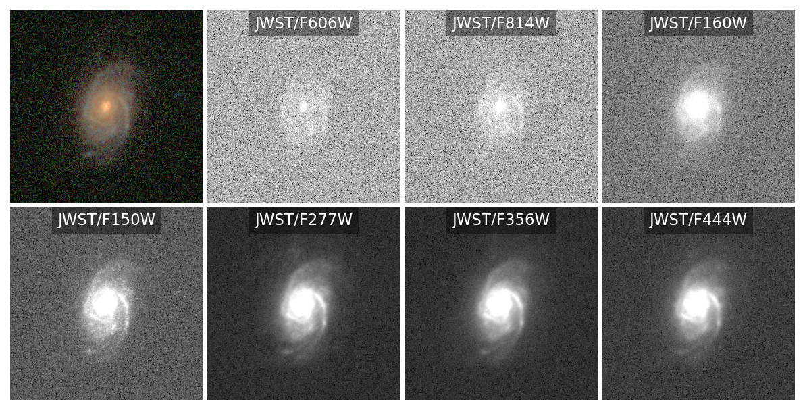
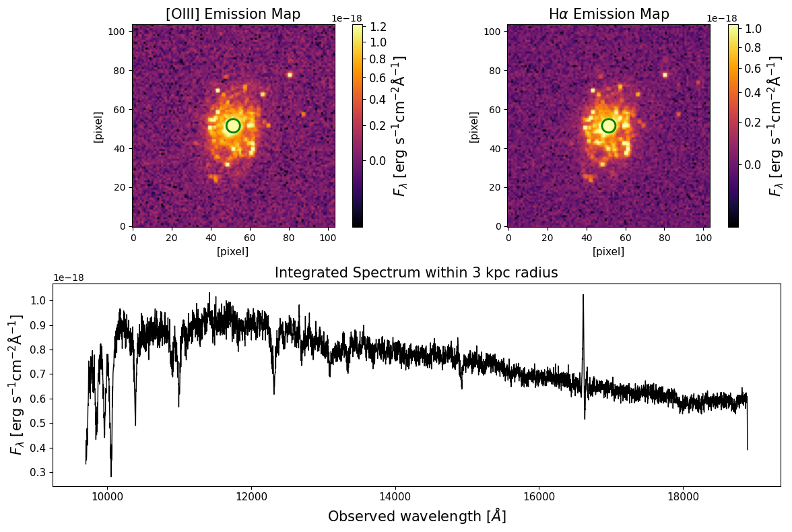

Simulating the Observational Effects
====================================
To bridge the gap between theoretical models and observational data, it is essential to account for the limitations of astronomical instruments. 

Adding observational effects on synthetic imaging data 
------------------------------------------------------

The ``GalSynMockObservation_imaging`` class in the ``observe`` module transforms idealized synthetic images into realistic mock observations. 
The process include spatial resapling (to a user-defined pixel scale, matching to the instrument characterictics), PSF convolution, noise simulation and injection. 
Please refer Abdurro'uf et al. (2026) for detailed descriptions about the algorithm used. 

Below is an example script for adding the observational effects into a synthetic data cube. 
First, we define the telescope and sky conditions for each filter. 
This includes providing the PSF images, instrumental zero-points, and the desired noise characteristics.

.. code-block:: python

    from galsyn import GalSynMockObservation_imaging
    from galsyn.utils import make_filter_transmission_text_pixedfit

    # select a set of filters to be processed
    filters = ['hst_acs_f435w', 'hst_acs_f606w', 'hst_acs_f814w', 'hst_wfc3_ir_f125w',
                'hst_wfc3_ir_f140w', 'hst_wfc3_ir_f160w', 'jwst_nircam_f090w', 'jwst_nircam_f115w',
                'jwst_nircam_f150w', 'jwst_nircam_f200w', 'jwst_nircam_f277w', 'jwst_nircam_f356w',
                'jwst_nircam_f410m', 'jwst_nircam_f444w']

    filter_transmission_path1 = make_filter_transmission_text_pixedfit(filters, output_dir="filters")

    # Pixel size of your provided PSF images
    psf_pixel_scales = {'hst_acs_f435w': 0.04, 'hst_acs_f606w': 0.04,
                'hst_acs_f814w': 0.04, 'hst_wfc3_ir_f125w': 0.04,
                'hst_wfc3_ir_f140w': 0.04, 'hst_wfc3_ir_f160w': 0.04,
                'jwst_nircam_f090w': 0.02, 'jwst_nircam_f115w': 0.02,
                'jwst_nircam_f150w': 0.02, 'jwst_nircam_f200w': 0.02,
                'jwst_nircam_f277w': 0.04, 'jwst_nircam_f356w': 0.04,
                'jwst_nircam_f410m': 0.04, 'jwst_nircam_f444w': 0.04}

    # Desired limiting magnitudes to be achieved
    limiting_magnitude = {'hst_acs_f435w': 29.3, 'hst_acs_f606w': 29.1,
                    'hst_acs_f814w': 29.1, 'hst_wfc3_ir_f125w': 28.5,
                    'hst_wfc3_ir_f140w': 28.2, 'hst_wfc3_ir_f160w': 29.1,
                    'jwst_nircam_f090w': 29.7, 'jwst_nircam_f115w': 30.2,
                    'jwst_nircam_f150w': 29.9, 'jwst_nircam_f200w': 30.1, 
                    'jwst_nircam_f277w': 30.9, 'jwst_nircam_f356w': 30.8,
                    'jwst_nircam_f410m': 30.1, 'jwst_nircam_f444w': 30.2}

    # Exposure time used in the observations in seconds.
    exposure_time = {'hst_acs_f435w': 68473, 'hst_acs_f606w': 11525,
                    'hst_acs_f814w': 61992, 'hst_wfc3_ir_f125w': 18281,
                    'hst_wfc3_ir_f140w': 6903, 'hst_wfc3_ir_f160w': 19382,
                    'jwst_nircam_f090w': 11338, 'jwst_nircam_f115w': 22676,
                    'jwst_nircam_f150w': 11338, 'jwst_nircam_f200w': 11338, 
                    'jwst_nircam_f277w': 11330, 'jwst_nircam_f356w': 11328, 
                    'jwst_nircam_f410m': 8503, 'jwst_nircam_f444w': 11319}

    # Target depth and instrument parameters
    psf_paths = {ff: f"PSF_{ff}.fits" for ff in filters}
    mag_zp = {ff: 28.1 for ff in filters}
    snr_limit = {ff: 5.0 for ff in filters}
    aperture_radius_arcsec = {ff: 0.1 for ff in filters}
    desired_pixel_scales = {ff: 0.03 for ff in filters} # Final resampled resolution

    fits_file_path = 'galsyn_39_107965_photo.fits'

    # Initialize the mock observation object
    simg = GalSynMockObservation_imaging(fits_file_path, filters, psf_paths, psf_pixel_scales, mag_zp,
                                        limiting_magnitude, snr_limit, aperture_radius_arcsec,
                                        exposure_time, filter_transmission_path1, desired_pixel_scales)

    # Start the pipeline: Resampling -> PSF Convolution -> Noise Injection
    simg.process_images(apply_noise_to_image=True, dust_attenuation=True)

    # Save the resulting science and RMS extensions to a new FITS file
    output_fits_path = 'obsimg_galsyn_39_107965_photo_30mas.fits'
    simg.save_results_to_fits(output_fits_path=output_fits_path)

Now, we check the resulting data cube

.. code-block:: python

    from astropy.io import fits 
    import matplotlib.pyplot as plt
    from astropy.visualization import simple_norm, make_lupton_rgb

    cube = fits.open('obsimg_galsyn_39_107965_photo_30mas.fits')

    # Filter configuration
    fils = ['hst_acs_f606w', 'hst_acs_f814w', 'hst_wfc3_ir_f160w', 'jwst_nircam_f150w', 
            'jwst_nircam_f277w', 'jwst_nircam_f356w', 'jwst_nircam_f444w']
    filnames = ['JWST/F606W', 'JWST/F814W', 'JWST/F160W', 'JWST/F150W', 
                'JWST/F277W', 'JWST/F356W', 'JWST/F444W']
    nbands = len(fils)

    # RGB components (using JWST NIRCam filters)
    rgb_fils = ['jwst_nircam_f115w', 'jwst_nircam_f150w', 'jwst_nircam_f200w']

    nrows, ncols = 2, 4
    fig = plt.figure(figsize=(ncols*2.5, nrows*2.5), dpi=150)

    # RGB Composite
    ax_rgb = fig.add_subplot(nrows, ncols, 1)
    factor = 2e+3

    # Access data using the standard 'DUST[FILTER]' extension name 
    r = cube[f'SCI_DUST_{rgb_fils[2]}'].data * factor
    g = cube[f'SCI_DUST_{rgb_fils[1]}'].data * factor
    b = cube[f'SCI_DUST_{rgb_fils[0]}'].data * factor

    rgb = make_lupton_rgb(r, g, b, stretch=50, Q=10)
    ax_rgb.imshow(rgb, origin='lower')
    ax_rgb.axis('off') # Cleanly removes all ticks and labels

    # Individual Grayscale Bands
    for ii in range(nbands):
        ax = fig.add_subplot(nrows, ncols, ii+2)
        
        # Access dust-attenuated imaging data 
        data = cube[f'SCI_DUST_{fils[ii]}'].data
        
        # Apply square-root normalization to improve dynamic range visibility
        norm = simple_norm(data, 'sqrt', percent=97.5)
        ax.imshow(data, norm=norm, origin='lower', cmap='gray')
        ax.axis('off')

        # Add filter labels with a small background box for readability
        ax.text(0.5, 0.93, filnames[ii], color='white', fontsize=11,
                ha='center', va='center', transform=ax.transAxes,
                bbox=dict(facecolor='black', alpha=0.4, lw=0))

    plt.subplots_adjust(hspace=0.02, wspace=0.02)
    plt.show()

Adding observational effects on synthetic IFU data 
--------------------------------------------------

Beyond broadband imaging, GalSyn allows you to simulate realistic Integral Field Unit (IFU) observations. 
This process transforms idealized spectral cubes into mock observations by accounting for wavelength-dependent sensitivity, instrumental resolution, and spatial blurring.

In this example, we will simulate mock JWST NIRSpec IFU high-resolution data using the G140H/F070LP configuration. 
First, you must model the PSF cube for this specific disperser-filter combination. This can be done using the STPSF package; 
the procedures for this are available in the `STPSF documentation <https://stpsf.readthedocs.io/en/latest/jwst_ifu_datacubes.html#Simulating-IFU-mode-and-Datacubes>`_.

The ``observe`` module requires a PSF cube where the wavelength axis matches your desired output grid. 
Since STPSF outputs multiple extensions, we first extract and standardize the ``DET_DIST`` data.

.. code-block:: python

    import numpy as np
    from astropy.io import fits

    # The PSF FITS file from STPSF package has multiple extensions. 
    # We use the DET_DIST extension and store it in a single-extension file.
    hdu = fits.open('psf_cube_G140H_F100LP.fits')
    psf_cube_data = hdu['DET_DIST'].data

    # Extract wavelength information for each slice in the PSF cube
    cube_psf_wave_um = np.zeros(psf_cube_data.shape[0])
    for i in range(psf_cube_data.shape[0]):
        cube_psf_wave_um[i] = hdu['det_dist'].header["WVLN%04d" % i] * 1e+6
    hdu.close()

    # Save as a standardized input for GalSyn
    hdul = fits.HDUList()
    hdul.append(fits.ImageHDU(data=psf_cube_data, name='psf_cube'))
    hdul.writeto('psf_G140H_F100LP_standard.fits', overwrite=True)

The ``GalSynMockObservation_ifu`` module processes the data through a specific sequence designed for 3D spectroscopic data:

    * Spectral Grid Alignment: The high-resolution synthetic cube is interpolated onto your ``desired_wave_grid``.
    * Spatial Resampling: The cube is resampled to the ``final_pixel_scale_arcsec`` while maintaining flux conservation.
    * Spectral Smoothing: Each spaxel is convolved along the wavelength axis with a Gaussian kernel to match the target instrumental resolution (:math:`R`).
    * Spatial PSF Convolution: The cube is convolved slice-by-slice using the 3D PSF cube to account for wavelength-dependent blurring.
    * Noise Injection: Realistic, wavelength-dependent noise is injected independently into each slice.

Additional notes:

    * Wavelength-dependent parameters: unlike imaging, parameters like ``limiting_magnitude`` and ``exposure_time`` can be provided as functions of wavelength to model instrument sensitivity variations accurately.
    * Spectral smoothing: the module uses your ``spectral_resolution_R`` to derive the kernel width (:math:`\sigma = \lambda / R / 2.355`) for each wavelength channel.

.. code-block:: python

    from scipy.interpolate import interp1d
    from galsyn import GalSynMockObservation_ifu

    fits_file_path = 'galsyn_39_107965_specphoto.fits'
    desired_wave_grid = cube_psf_wave_um * 1e+4  # Convert microns to Angstroms
    psf_cube_path = 'psf_G140H_F100LP_standard.fits'

    # Observation parameters
    psf_pixel_scale = 0.1
    spectral_resolution_R = 2700
    mag_zp = 28.0
    exposure_time = 15000
    final_pixel_scale_arcsec = 0.1

    # Define a wavelength-dependent limiting magnitude function
    limiting_magnitude_wave_func = interp1d([min(desired_wave_grid), max(desired_wave_grid)],
                                            [25.0, 24.5], fill_value="extrapolate")
    snr_limit = 5.0

    # Initialize and run the IFU pipeline
    sifu = GalSynMockObservation_ifu(fits_file_path, desired_wave_grid, psf_cube_path, psf_pixel_scale,
                    spectral_resolution_R, mag_zp, limiting_magnitude_wave_func, snr_limit,
                    final_pixel_scale_arcsec, exposure_time)

    sifu.process_datacube(dust_attenuation=True, apply_noise_to_cube=True)

    # Save the final realistic IFU data cube
    output_fits_path = 'obsifu_nirspec_g140h_f100lp_galsyn_39_107965_100mas.fits'
    sifu.save_results_to_fits(output_fits_path)

Let's check the output data cube.

.. code-block:: python

    import matplotlib.pyplot as plt
    from astropy.visualization import simple_norm
    import matplotlib.gridspec as gridspec
    import matplotlib.patches as patches 
    import matplotlib.cm as cm 
    from astropy.cosmology import Planck18 as cosmo
    import astropy.units as u

    cube = fits.open('obsifu_nirspec_g140h_f100lp_galsyn_39_107965_100mas.fits')

    sci_data = cube['SCI_DUST'].data
    wavelength = cube['WAVELENGTH_GRID'].data['WAVELENGTH']

    # get physical scale of pixel in kpc
    z = 1.531239    # redshift 
    kpc_per_arcsec = 1.0 / cosmo.arcsec_per_kpc_proper(z).value
    pix_kpc = cube[0].header['pixsize'] * kpc_per_arcsec
    print (f'physical scale of pixel: {pix_kpc} kpc')
    radius_kpc = 3.0
    radius_pixels = radius_kpc / pix_kpc

    # Select wavelength grids around the OIII and H-alpha lines
    oiii_wave_range = [5007*(1.0+z)-200, 5007*(1.0+z)+200]
    halpha_wave_range = [6564*(1.0+z)-200, 6564*(1.0+z)+200]
    oiii_indices = np.where((wavelength >= oiii_wave_range[0]) & (wavelength <= oiii_wave_range[1]))[0]
    halpha_indices = np.where((wavelength >= halpha_wave_range[0]) & (wavelength <= halpha_wave_range[1]))[0]

    # Integrate to get the 2D maps
    oiii_map = np.sum(sci_data[oiii_indices, :, :], axis=0)
    halpha_map = np.sum(sci_data[halpha_indices, :, :], axis=0)

    # Get the spatial dimensions
    nz, ny, nx = sci_data.shape
    center_x, center_y = (nx-1.0)/2.0, (ny-1.0)/2.0

    # Create a circular mask
    y, x = np.ogrid[:ny, :nx]
    dist_from_center = np.sqrt((x - center_x)**2 + (y - center_y)**2)
    mask = dist_from_center <= radius_pixels

    # Create masked data cube
    masked_sci_data0 = sci_data * mask

    # Integrated spectrum
    integrated_spectrum0 = np.sum(masked_sci_data0, axis=(1, 2))

    # Create the multipanel plot
    plt.figure(figsize=(12, 8))
    gs = gridspec.GridSpec(2, 2, width_ratios=[1, 1], height_ratios=[1, 1])

    # OIII map
    ax0 = plt.subplot(gs[0, 0])

    cmap = cm.get_cmap('inferno').copy()
    cmap.set_bad(color='black')
    norm = simple_norm(oiii_map, 'sqrt', percent=98.5)
    im0 = ax0.imshow(oiii_map, norm=norm, origin='lower', cmap=cmap)

    ax0.set_title('[OIII] Emission Map', fontsize=15)
    ax0.set_xlabel('[pixel]', fontsize=11)
    ax0.set_ylabel('[pixel]', fontsize=11)
    #plt.colorbar(im0, ax=ax0, label='Integrated Flux')

    cbar = plt.colorbar(im0, ax=ax0)
    cbar.set_label(r'$F_{\lambda}$ [erg $\rm{s}^{-1}\rm{cm}^{-2}\AA^{-1}$]', fontsize=15)
    cbar.ax.tick_params(labelsize=12)

    # New code to add circle to OIII map
    circle0 = patches.Circle((center_x, center_y), radius_pixels, edgecolor='green', facecolor='none', linewidth=2)
    ax0.add_patch(circle0)
    # End of new code

    # H-alpha map
    ax1 = plt.subplot(gs[0, 1])

    cmap = cm.get_cmap('inferno').copy()
    cmap.set_bad(color='black')
    norm = simple_norm(halpha_map, 'sqrt', percent=98.5)
    im1 = ax1.imshow(halpha_map, norm=norm, origin='lower', cmap=cmap)

    ax1.set_title(r'H$\alpha$ Emission Map', fontsize=15)
    ax1.set_xlabel('[pixel]', fontsize=11)
    ax1.set_ylabel('[pixel]', fontsize=11)

    cbar = plt.colorbar(im1, ax=ax1)
    cbar.set_label(r'$F_{\lambda}$ [erg $\rm{s}^{-1}\rm{cm}^{-2}\AA^{-1}$]', fontsize=15)
    cbar.ax.tick_params(labelsize=12)

    # New code to add circle to H-alpha map
    circle1 = patches.Circle((center_x, center_y), radius_pixels, edgecolor='green', facecolor='none', linewidth=2)
    ax1.add_patch(circle1)
    # End of new code

    # Integrated spectrum
    ax2 = plt.subplot(gs[1, :])
    ax2.plot(wavelength, integrated_spectrum0, lw=1, color='black')
    ax2.set_title('Integrated Spectrum within 3 kpc radius', fontsize=15)
    ax2.set_xlabel(r'Observed wavelength [$\AA$]', fontsize=15)
    ax2.set_ylabel(r'$F_{\lambda}$ [erg $\rm{s}^{-1}\rm{cm}^{-2}\AA^{-1}$]', fontsize=15)
    plt.setp(ax2.get_yticklabels(), fontsize=11)
    plt.setp(ax2.get_xticklabels(), fontsize=11)

    plt.tight_layout()

