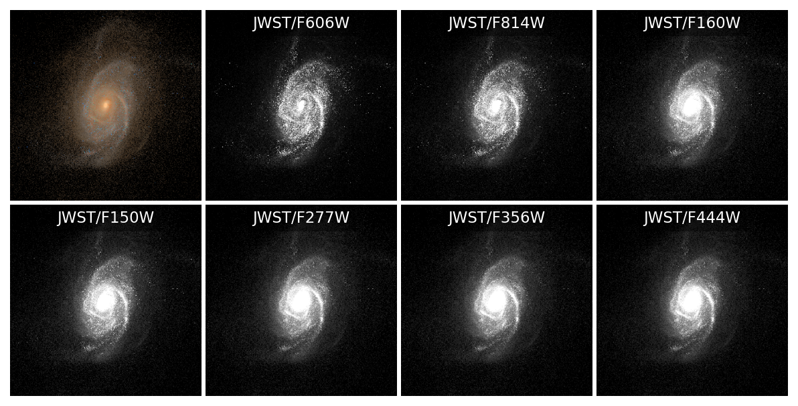
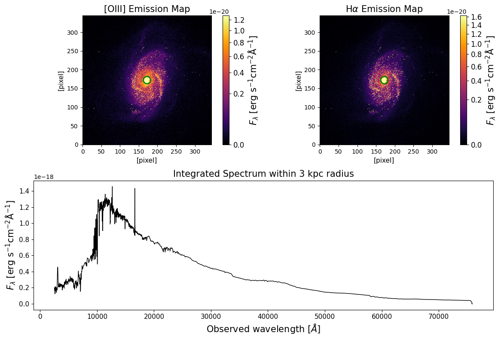

Generating Idealized Synthetic Data Cubes
=========================================

With all the preparatory steps completed, we can now initialize the ``GalaxySynthesizer`` class and run the synthesis process. 
To generate synthetic data cubes using ``GalaxySynthesizer``, we need the filters and their transmission curves that are set up previously in :doc:`setting_filters`. 

Generating idealized imaging data cubes
---------------------------------------

The following script demonstrates the generation of imaging data cube with line-of-sight dust-attenuation modeling method and 
the modified Calzetti dust law with a dynamic slope and bump strength that depends on :math:`A_{V}`. 

.. code-block:: python

    from galsyn import GalaxySynthesizer
    from galsyn.dust import relation_AVslope
    from galsyn.simutils_tng import get_snap_z

    # Your personal API key from the IllustrisTNG website
    api_key = "your_api_key"

    # Specify simulation parameters
    sim = 'TNG50-1'         # The TNG simulation run
    snap_number = 39        # The snapshot index (e.g., z ~ 1.5 in IllustrisTNG)
    subhalo_id = 107965     # The subhalo ID

    # Retrieve the exact redshift for the given snapshot number using the TNG API
    z = get_snap_z(snap_number, api_key=api_key)
    print ('Redshift: %lf' % z)

    # Define the output path for the standardized file, generated using the script in Example 1
    sim_file = f'sim_file_tng_{int(snap_number)}_{int(subhalo_id)}.hdf5'

    gs = GalaxySynthesizer(sim_file, z=z, filters=filters, filter_transmission_path=filter_transmission_path)

    gs.ssp_filepath = 'ssp_fsps.hdf5'         # path to the FSPS SSP grids generated in Example 2
    gs.ssp_interpolation_method = 'nearest'

    gs.dim_kpc = 90                # Image side length in kpc
    gs.smoothing_length = 0.15     # Smoothing length of the simulation in kpc
    gs.pix_arcsec = 0.03           # Output pixel scale in arcseconds

    gs.flux_unit = 'MJy/sr'        # Desired unit for the output FITS file

    gs.polar_angle_deg = 0.0       # Polar angle or inclination
    gs.azimuth_angle_deg = 0.0     # azimuth angle or rotation in the xy-plane

    # Dust attenuation modeling method
    gs.dust_method = 'los'             # line-of-sight method

    # modified Calzetti et al. (2000) with variable slope and Bump
    gs.dust_law = 0                  

    # Apply dynamic slope (steeper for lower AV and shallower for higher AV) 
    dict_AV_dustindex = relation_AVslope(model_name="salim18")
    gs.dust_index = dict_AV_dustindex

    # Apply dynamic Bump strength tied to the slope (Kriek & Conroy 2013)
    dict_AV_bump_amp = {}
    dict_AV_bump_amp['AV'] = dict_AV_dustindex['AV']
    dict_AV_bump_amp['bump_amp'] = 0.85 - 1.9*dict_AV_dustindex['dust_index']
    gs.bump_amp = dict_AV_bump_amp 

    # Set fixed Bump width
    gs.bump_dwave = 0.035            # in micron

    gs.dust_eta = 1.0                # Ratio of AV in birth clouds vs diffuse ISM
    gs.dust_index_bc = -0.7          # Power-law slope for birth clouds

    gs.ncpu = 5                      # number of CPU cores to use
    gs.output_pixel_spectra = False  # Generate broadband images only (not including spectra)

    gs.name_out_img = f'galsyn_{int(snap_number)}_{int(subhalo_id)}_photo.fits'

    # Run the synthetis process
    gs.run_synthesis()

Generating idealized imaging + spectroscopy data cubes
------------------------------------------------------

The following script demonstrates the generation of spectrophotometric data cube with line-of-sight dust-attenuation modeling method and 
the modified Calzetti dust law with a dynamic slope and bump strength that depends on :math:`A_{V}`. 

.. code-block:: python

    from galsyn import GalaxySynthesizer
    from galsyn.dust import relation_AVslope
    from galsyn.simutils_tng import get_snap_z

    # Your personal API key from the IllustrisTNG website
    api_key = "your_api_key"

    # Specify simulation parameters
    sim = 'TNG50-1'         # The TNG simulation run
    snap_number = 39        # The snapshot index (e.g., z ~ 1.5 in IllustrisTNG)
    subhalo_id = 107965     # The subhalo ID

    # Retrieve the exact redshift for the given snapshot number using the TNG API
    z = get_snap_z(snap_number, api_key=api_key)
    print ('Redshift: %lf' % z)

    # Define the output path for the standardized file, generated using the script in Example 1
    sim_file = f'sim_file_tng_{int(snap_number)}_{int(subhalo_id)}.hdf5'

    gs = GalaxySynthesizer(sim_file, z=z, filters=filters, filter_transmission_path=filter_transmission_path)

    gs.ssp_filepath = 'ssp_fsps.hdf5'         # path to the FSPS SSP grids generated in Example 2
    gs.ssp_interpolation_method = 'nearest'

    gs.dim_kpc = 90                # Image side length in kpc
    gs.smoothing_length = 0.15     # Smoothing length of the simulation in kpc
    gs.pix_arcsec = 0.03           # Output pixel scale in arcseconds

    # Desired unit for the imaging data
    # IFS data would always have flux unit of erg/s/cm^2/Angstrom
    gs.flux_unit = 'MJy/sr'        

    gs.polar_angle_deg = 0.0       # Polar angle or inclination
    gs.azimuth_angle_deg = 0.0     # azimuth angle or rotation in the xy-plane

    # Dust attenuation modeling method
    gs.dust_method = 'los'             # line-of-sight method

    # modified Calzetti et al. (2000) with variable slope and Bump
    gs.dust_law = 0                  

    # Apply dynamic slope (steeper for lower AV and shallower for higher AV) 
    dict_AV_dustindex = relation_AVslope(model_name="salim18")
    gs.dust_index = dict_AV_dustindex

    # Apply dynamic Bump strength tied to the slope (Kriek & Conroy 2013)
    dict_AV_bump_amp = {}
    dict_AV_bump_amp['AV'] = dict_AV_dustindex['AV']
    dict_AV_bump_amp['bump_amp'] = 0.85 - 1.9*dict_AV_dustindex['dust_index']
    gs.bump_amp = dict_AV_bump_amp 

    # Set fixed Bump width
    gs.bump_dwave = 0.035            # in micron

    gs.dust_eta = 1.0                # Ratio of AV in birth clouds vs diffuse ISM
    gs.dust_index_bc = -0.7          # Power-law slope for birth clouds

    gs.ncpu = 5                      # number of CPU cores to use

    # Set up output spectra
    # Wavelength range set here should be within the range set for the SSP grids in Example 2
    # Wavelength incerement determines the number of wavelength grids in the IFS data and resulting file size
    gs.output_pixel_spectra = True   # Include spectra
    gs.rest_wave_min = 1000.0        
    gs.rest_wave_max = 30000.0
    gs.rest_delta_wave = 5.0         # in Angstrom

    gs.name_out_img = f'galsyn_{int(snap_number)}_{int(subhalo_id)}_specphoto.fits'

    # Run the synthetis process
    gs.run_synthesis()

Check the generated data cube
-----------------------------

In the following scipt, we extract some images from the data cube, make RGB image, and show them in a plot. 

.. code-block:: python

    from astropy.io import fits
    import matplotlib.pyplot as plt
    from astropy.visualization import simple_norm, make_lupton_rgb

    cube = fits.open('galsyn_39_107965_specphoto.fits')

    # Filter configuration
    fils = ['hst_acs_f606w', 'hst_acs_f814w', 'hst_wfc3_ir_f160w', 'jwst_nircam_f150w', 
            'jwst_nircam_f277w', 'jwst_nircam_f356w', 'jwst_nircam_f444w']
    filnames = ['JWST/F606W', 'JWST/F814W', 'JWST/F160W', 'JWST/F150W', 
                'JWST/F277W', 'JWST/F356W', 'JWST/F444W']
    nbands = len(fils)

    # RGB components (using JWST NIRCam filters)
    rgb_fils = ['jwst_nircam_f115w', 'jwst_nircam_f150w', 'jwst_nircam_f200w']

    nrows, ncols = 2, 4
    fig = plt.figure(figsize=(ncols*2.5, nrows*2.5), dpi=150)

    # RGB Composite
    ax_rgb = fig.add_subplot(nrows, ncols, 1)
    factor = 3e+3

    # Access data using the standard 'DUST[FILTER]' extension name 
    r = cube[f'DUST_{rgb_fils[2]}'].data * factor
    g = cube[f'DUST_{rgb_fils[1]}'].data * factor
    b = cube[f'DUST_{rgb_fils[0]}'].data * factor

    rgb = make_lupton_rgb(r, g, b, stretch=20, Q=15)
    ax_rgb.imshow(rgb, origin='lower')
    ax_rgb.axis('off') # Cleanly removes all ticks and labels

    # Individual Grayscale Bands
    for ii in range(nbands):
        ax = fig.add_subplot(nrows, ncols, ii+2)
        
        # Access dust-attenuated imaging data 
        data = cube[f'DUST_{fils[ii]}'].data
        
        # Apply square-root normalization to improve dynamic range visibility
        norm = simple_norm(data, 'sqrt', percent=97.5)
        ax.imshow(data, norm=norm, origin='lower', cmap='gray')
        ax.axis('off')

        # Add filter labels with a small background box for readability
        ax.text(0.5, 0.93, filnames[ii], color='white', fontsize=11,
                ha='center', va='center', transform=ax.transAxes,
                bbox=dict(facecolor='black', alpha=0.4, lw=0))

    plt.subplots_adjust(hspace=0.02, wspace=0.02)
    plt.show()

Next, we check spectrum integrated within a circular aperture around the galaxy's center along with maps of [OIII] and :math:`\text{H}_{\alpha}`. 

.. code-block:: python

    import matplotlib.gridspec as gridspec
    import matplotlib.patches as patches 
    import matplotlib.cm as cm
    import numpy as np 

    sci_data = cube['OBS_SPEC_DUST'].data
    wavelength = cube['WAVELENGTH_GRID'].data['WAVELENGTH']

    pix_kpc = cube[0].header['pix_kpc'] 
    radius_kpc = 2.5
    radius_pixels = radius_kpc / pix_kpc

    # Select wavelength grids around the OIII and H-alpha lines
    oiii_wave_range = [5007*(1.0+z)-100, 5007*(1.0+z)+100]
    halpha_wave_range = [6564*(1.0+z)-100, 6564*(1.0+z)+100]
    oiii_indices = np.where((wavelength >= oiii_wave_range[0]) & (wavelength <= oiii_wave_range[1]))[0]
    halpha_indices = np.where((wavelength >= halpha_wave_range[0]) & (wavelength <= halpha_wave_range[1]))[0]

    # Integrate to get the 2D maps
    oiii_map = np.sum(sci_data[oiii_indices, :, :], axis=0)
    halpha_map = np.sum(sci_data[halpha_indices, :, :], axis=0)

    # Get the spatial dimensions
    nz, ny, nx = sci_data.shape
    center_x, center_y = (nx-1.0)/2.0, (ny-1.0)/2.0

    # Create a circular mask
    y, x = np.ogrid[:ny, :nx]
    dist_from_center = np.sqrt((x - center_x)**2 + (y - center_y)**2)
    mask = dist_from_center <= radius_pixels

    # Create masked data cube
    masked_sci_data0 = sci_data * mask

    # Integrated spectrum
    integrated_spectrum0 = np.sum(masked_sci_data0, axis=(1, 2))

    # Create the multipanel plot
    plt.figure(figsize=(12, 8))
    gs = gridspec.GridSpec(2, 2, width_ratios=[1, 1], height_ratios=[1, 1])

    # OIII map
    ax0 = plt.subplot(gs[0, 0])

    cmap = cm.get_cmap('inferno').copy()
    cmap.set_bad(color='black')
    norm = simple_norm(oiii_map, 'sqrt', percent=98.5)
    im0 = ax0.imshow(oiii_map, norm=norm, origin='lower', cmap=cmap)

    ax0.set_title('[OIII] Emission Map', fontsize=15)
    ax0.set_xlabel('[pixel]', fontsize=11)
    ax0.set_ylabel('[pixel]', fontsize=11)
    #plt.colorbar(im0, ax=ax0, label='Integrated Flux')

    cbar = plt.colorbar(im0, ax=ax0)
    cbar.set_label(r'$F_{\lambda}$ [erg $\rm{s}^{-1}\rm{cm}^{-2}\AA^{-1}$]', fontsize=15)
    cbar.ax.tick_params(labelsize=12)

    # New code to add circle to OIII map
    circle0 = patches.Circle((center_x, center_y), radius_pixels, edgecolor='green', facecolor='none', linewidth=2)
    ax0.add_patch(circle0)
    # End of new code

    # H-alpha map
    ax1 = plt.subplot(gs[0, 1])

    cmap = cm.get_cmap('inferno').copy()
    cmap.set_bad(color='black')
    norm = simple_norm(halpha_map, 'sqrt', percent=98.5)
    im1 = ax1.imshow(halpha_map, norm=norm, origin='lower', cmap=cmap)

    ax1.set_title(r'H$\alpha$ Emission Map', fontsize=15)
    ax1.set_xlabel('[pixel]', fontsize=11)
    ax1.set_ylabel('[pixel]', fontsize=11)

    cbar = plt.colorbar(im1, ax=ax1)
    cbar.set_label(r'$F_{\lambda}$ [erg $\rm{s}^{-1}\rm{cm}^{-2}\AA^{-1}$]', fontsize=15)
    cbar.ax.tick_params(labelsize=12)

    # New code to add circle to H-alpha map
    circle1 = patches.Circle((center_x, center_y), radius_pixels, edgecolor='green', facecolor='none', linewidth=2)
    ax1.add_patch(circle1)
    # End of new code

    # Integrated spectrum
    ax2 = plt.subplot(gs[1, :])
    ax2.plot(wavelength, integrated_spectrum0, lw=1, color='black')
    ax2.set_title('Integrated Spectrum within 3 kpc radius', fontsize=15)
    ax2.set_xlabel(r'Observed wavelength [$\AA$]', fontsize=15)
    ax2.set_ylabel(r'$F_{\lambda}$ [erg $\rm{s}^{-1}\rm{cm}^{-2}\AA^{-1}$]', fontsize=15)
    plt.setp(ax2.get_yticklabels(), fontsize=11)
    plt.setp(ax2.get_xticklabels(), fontsize=11)

    plt.tight_layout()
    plt.show()

