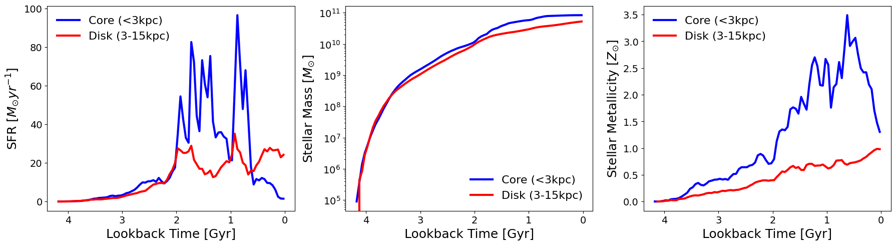

Reconstructing Star Formation History
=====================================

Understanding how a galaxy was assembled over cosmic time requires analyzing the formation properties of its star particles on a pixel-by-pixel basis. 
The ``SFHReconstructor`` class in GalSyn provides a powerful tool to map the growth and chemical evolution across the entire region of galaxy. 
By binning star particles into discrete time intervals based on their formation lookback time, this module derives key milestones like 
cumulative mass assembly and mass-weighted metallicity histories for every spatial pixel. 

Below, is an example script for reconstructing spatially resolved SFH of a simulated galaxy.

.. code-block:: python

    from galsyn.simutils_tng import get_snap_z
    from galsyn import SFHReconstructor

    # Your personal API key from the IllustrisTNG website
    api_key = "your_api_key"

    # Specify simulation parameters
    sim = 'TNG50-1'         # The TNG simulation run
    snap_number = 39        # The snapshot index (e.g., z ~ 1.5 in IllustrisTNG)
    subhalo_id = 107965     # The subhalo ID

    # Retrieve the exact redshift for the given snapshot number using the TNG API
    z = get_snap_z(snap_number, api_key=api_key)
    print ('Redshift: %lf' % z)

    # Define the output path for the standardized file, generated using the script in Example 1
    sim_file = f'sim_file_tng_{int(snap_number)}_{int(subhalo_id)}.hdf5'

    # Initialize the Reconstructor
    # Z_sun=0.019 is the default solar metallicity for FSPS/MIST
    sfh = SFHReconstructor(sim_file, z, Z_sun=0.019)

    sfh.dim_kpc = 90                # Spatial side length of the grid in kpc
    sfh.pix_arcsec = 0.03           # Angular size of each pixel

    sfh.polar_angle_deg = 0.0       # Polar angle or inclination
    sfh.azimuth_angle_deg = 0.0     # azimuth angle or rotation in the xy-plane

    sfh.ncpu = 5                    # Number of CPU cores for parallel processing
    sfh.sfh_del_t = 0.05            # Lookback time bin width in Gyr

    sfh.name_out_sfh = f"galsyn_sfh_{int(snap_number)}_{int(subhalo_id)}.fits"

    # Execute the reconstruction
    sfh.reconstruct_sfh()

In the following script, we plot star formation and chemical eenrichment histories of spatial regions within central 3 kpc radius and the disk (3-15 kpc). 

.. code-block:: python

    import numpy as np
    import matplotlib.pyplot as plt
    from astropy.io import fits

    # Load Data
    filename = f"galsyn_sfh_{int(snap_number)}_{int(subhalo_id)}.fits"

    with fits.open(filename) as hdul:
        # Transpose 3D cubes to (time, y, x) and extract scalars
        sfr_cube = np.transpose(hdul['SFR'].data, (2, 0, 1))
        mass_cube = np.transpose(hdul['MASS'].data, (2, 0, 1))
        cumul_cube = np.transpose(hdul['CUMUL_MASS'].data, (2, 0, 1))
        met_cube = np.transpose(hdul['METALLICITY'].data, (2, 0, 1))
        
        t_maps = [hdul[f'T_{p}_PERCENT'].data for p in [5, 10, 25, 50, 75, 95]]
        lookback_time = hdul['LOOKBACK_TIME_BINS'].data
        pix_kpc = hdul[0].header['PIX_KPC']

    # Create Spatial Masks
    ny, nx = sfr_cube.shape[1:]
    y, x = np.ogrid[:ny, :nx]
    r_kpc = np.sqrt((x - nx//2)**2 + (y - ny//2)**2) * pix_kpc

    inner_m = r_kpc <= 3.0
    disk_m = (r_kpc > 3.0) & (r_kpc <= 15.0)

    # Vectorized Integration & Mass-Weighted Metallicity
    def get_stats(mask):
        # Sum over spatial axes (1, 2)
        sfr = np.sum(sfr_cube[:, mask], axis=1)
        cumul = np.sum(cumul_cube[:, mask], axis=1)
        
        # Mass-weighted metallicity: sum(Z * M) / sum(M) per time slice
        # Use nanamm to handle potential NaNs in metallicity
        weighted_met = np.nansum(met_cube[:, mask] * mass_cube[:, mask], axis=1) / np.sum(mass_cube[:, mask], axis=1)
        return sfr, cumul, weighted_met

    sfr_i, cumul_i, met_i = get_stats(inner_m)
    sfr_d, cumul_d, met_d = get_stats(disk_m)

    # Plotting SFH, Mass, Metallicity
    fig, axes = plt.subplots(1, 3, figsize=(18, 5))

    # Plotting config (shared across panels)
    line_cfg = {'inner': {'color': 'b', 'lw': 3, 'label': 'Core (<3kpc)'},
                'disk':  {'color': 'r', 'lw': 3, 'label': 'Disk (3-15kpc)'}}

    for ax, data_i, data_d, ylabel, is_log in zip(axes, 
        [sfr_i, cumul_i, met_i], [sfr_d, cumul_d, met_d],
        ['SFR [$M_{\odot} yr^{-1}$]', 'Stellar Mass [$M_{\odot}$]', 'Stellar Metallicity [$Z_{\odot}$]'],
        [False, True, False]):
        
        ax.plot(lookback_time, data_i, **line_cfg['inner'])
        ax.plot(lookback_time, data_d, **line_cfg['disk'])
        ax.set_xlabel('Lookback Time [Gyr]', fontsize=18)
        ax.set_ylabel(ylabel, fontsize=18)
        plt.setp(ax.get_yticklabels(), fontsize=14)
        plt.setp(ax.get_xticklabels(), fontsize=14)
        ax.invert_xaxis()
        if is_log: ax.set_yscale('log')

        ax.legend(frameon=False, fontsize=16)

    plt.tight_layout()
    plt.show()

